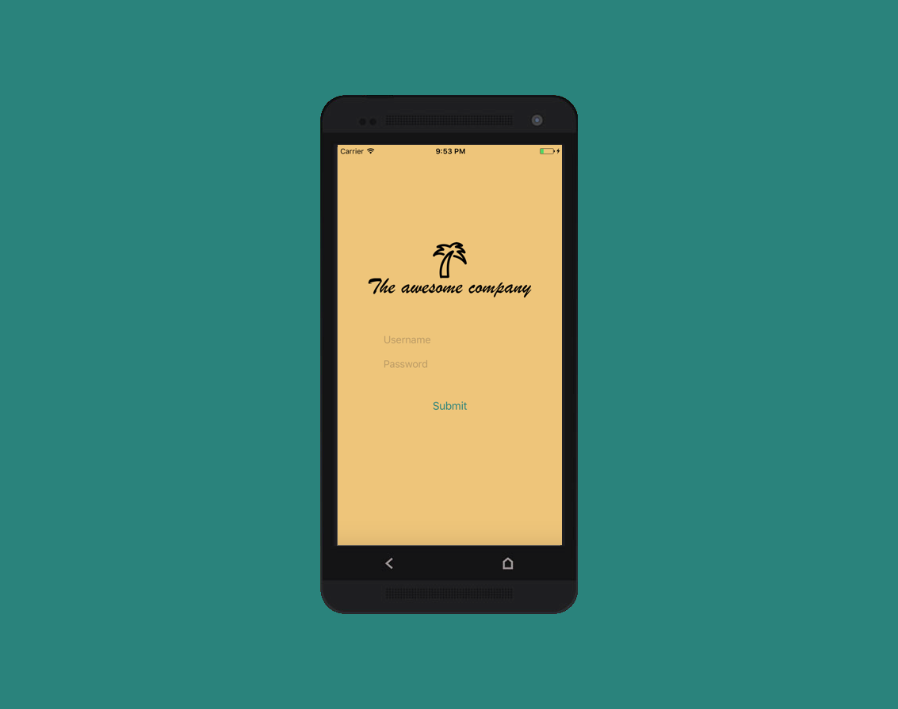

# The Awesome Company Mobile 📱

This repository is a boilerplate for setting up an hybrid mobile application that can connect to a Meteor server.

## Features

- Login and registration form
- User account management with MongoDB server
- Logout button

## Installation

- Clone the project
- Install React Native and required dependencies
- If not, start a meteor server with user account management with MongoDB server. Example: [The Awesome Company](https://github.com/ltacker/TheAwesomeCompany)
- Run `react-native run-ios` or `react-native run-android`
- 😘

## Additional notes

- The account creation is not supported from the mobile application